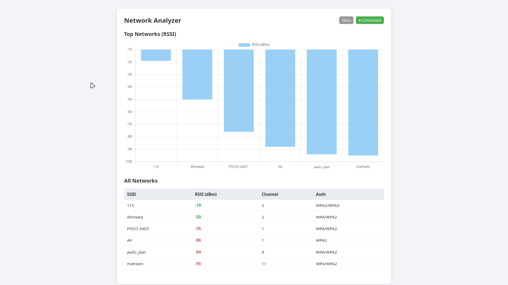
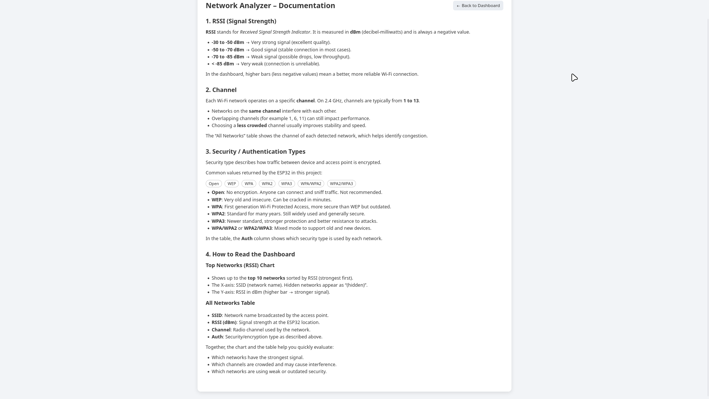

```md
#ESP32 Network Analyzer Tool  
Advanced Wi-Fi Scanning, Visualization & Security Insight

This project delivers a practical Network Analyzer built on ESP32, providing real-time scanning of nearby Wi-Fi networks, extracting key metadata (RSSI, Channels, Security Type), and streaming the results into a live web dashboard with charts and structured documentation.

---

##Core Features

###Real-Time Wi-Fi Scanning
- SSID  
- BSSID (MAC Address)  
- RSSI (Signal Strength)  
- Channel  
- Frequency Band  
- Security Type (Open, WEP, WPA, WPA2, WPA3)

### OLED Display Status
- IP Address  
- Connection State  
- Scan Progress  
- Network Count  

### Web Dashboard
- Real-time charts (RSSI strength, channel distribution)
- Dynamic table  
- Responsive UI (HTML + CSS + JavaScript)

###Documentation Page
- Security definitions  
- Channel theory  
- Explanation of dashboard charts  

---

##System Architecture

```

ESP32
│
├─ WiFi Scanning (scan.cpp)
├─ OLED Rendering (oled.cpp)
├─ LittleFS File Server (FileS.cpp)
├─ Async WebSocket Communication (ws_server.cpp)
│
└── Frontend (data/)
├── index.html
├── doc.html
├── app.js
└── style.css

```

---

##Project Structure

```

.
├── data
│   ├── app.js
│   ├── doc.html
│   ├── index.html
│   └── style.css
├── images
│   ├── doc.png
│   └── index.png
├── include
│   ├── FileS.h
│   ├── oled.h
│   ├── scan.h
│   └── ws_server.h
├── src
│   ├── FileS.cpp
│   ├── main.cpp
│   ├── oled.cpp
│   ├── scan.cpp
│   └── ws_server.cpp
├── platformio.ini
└── README.md

````

---

##Getting Started

### Requirements
- ESP32 Board  
- PlatformIO  
- LittleFS support  
- Web browser  

### Build & Upload

```sh
pio run
pio run --target upload
pio run --target uploadfs
````

### Access the Dashboard

```
http://<ESP32-IP>/index.html
```

Documentation:

```
http://<ESP32-IP>/doc.html
```

---

##Dashboard Insights

### RSSI Chart

Strength level of detected networks.

### Channel Distribution

Shows congestion and interference.

### Security Classification

| Security   | Meaning           | Risk   |
| ---------- | ----------------- | ------ |
| Open       | No encryption     | High   |
| WPA / WPA2 | Protected         | Medium |
| WPA3       | Modern encryption | Low    |

---

## Problem Solved

* Identifies congested Wi-Fi channels
* Analyzes network security levels
* Portable hardware-based analyzer
* Real-time visualization without external servers

---

## Future Upgrades

* 5 GHz scanning
* Handshake capture
* Heat-map visualization
* Export reports (JSON / CSV)
* Mobile-optimized UI

---

## Screenshots

### Dashboard



### Documentation Page



---

## Author

Hussein Ahmed
Computer Engineering & Information Technology
University of Technology

---

# License — MIT License

MIT License

Copyright (c) 2025 Hussein Ahmed

Permission is hereby granted, free of charge, to any person obtaining a copy
of this software and associated documentation files (the "Software"), to deal
in the Software without restriction, including without limitation the rights
to use, copy, modify, merge, publish, distribute, sublicense, and/or sell
copies of the Software, and to permit persons to whom the Software is
furnished to do so, subject to the following conditions:

The above copyright notice and this permission notice shall be included in all
copies or substantial portions of the Software.

THE SOFTWARE IS PROVIDED "AS IS", WITHOUT WARRANTY OF ANY KIND, EXPRESS OR
IMPLIED, INCLUDING BUT NOT LIMITED TO THE WARRANTIES OF MERCHANTABILITY,
FITNESS FOR A PARTICULAR PURPOSE AND NONINFRINGEMENT. IN NO EVENT SHALL THE
AUTHORS OR COPYRIGHT HOLDERS BE LIABLE FOR ANY CLAIM, DAMAGES OR OTHER
LIABILITY, WHETHER IN AN ACTION OF CONTRACT, TORT OR OTHERWISE, ARISING FROM,
OUT OF OR IN CONNECTION WITH THE SOFTWARE OR THE USE OR OTHER DEALINGS IN THE
SOFTWARE.

```
```

